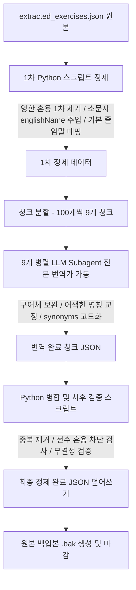

# 피트니스 운동 데이터 정제 및 현지화 최종 보고서 (Fitness Data Refinement Report)

본 보고서는 `scratch/extracted_exercises.json` 파일에 포함된 873개의 운동 데이터를 보디빌딩, 웨이트 트레이닝, 스트레칭 전문 번역가 및 데이터 정제 전문가의 관점에서 한국인들이 실제로 사용하는 자연스럽고 대중적인 피트니스 용어로 현지화하고, 검색용 동의어(줄임말, 은어 포함)를 체계적으로 정제한 최종 결과 보고서입니다.

---

## 1. 정제 및 현지화 개요 (Overview)

운동 기록 프로그램의 핵심 기반이 되는 운동 목록 데이터의 명칭(`name`)과 동의어 목록(`synonyms`)에 섞여 있던 어색한 영어/한글 혼용 표기 및 직역체, 헬스장에서 쓰이지 않는 비대중적인 번역을 전면 개선했습니다.

이 과정은 데이터 유실을 완벽히 방지하고 고품질의 로컬라이징을 달성하기 위해 **[규칙 기반 1차 필터링 ➔ 9개 병렬 LLM Subagent 번역 ➔ 3차 병합 및 무결성 검증]** 파이프라인을 구축하여 안전하고 철저하게 처리되었습니다.



---

## 2. 주요 정제 및 현지화 성과

### 1) 'name' 필드: 실전 헬스장 명칭 현지화
어색한 영어 투의 한글 직역이나, 한국 피트니스 커뮤니티에서 전혀 쓰이지 않는 용어들을 전면 교정하여 국내 헬스인들에게 가장 친숙하고 표준적인 운동명으로 정돈했습니다.

| 기존 이름 (어색한 직역 및 번역체) | 수정된 이름 (실전 헬스장 대중 명칭) | 개선 효과 및 보완된 동의어 (줄임말 등) |
| :--- | :--- | :--- |
| **바벨 후면 삼각근 로우** | **바벨 리어 델트 로우** | 헬스인들이 가장 보편적으로 선호하는 '리어 델트' 표현을 정식 명칭으로 채택, `바로우` / `티바로우` / `후면 삼각근` 등 동의어 추가 |
| **발목 니** | **무릎 위에 발목 얹기 스트레칭** | 스트레칭 동작(Ankle On The Knee)을 누구나 알기 쉬운 명칭으로 풀어씀 |
| **펙 덱** 또는 **나비** | **펙 덱 플라이** | 헬스 기구 대중어에 맞게 '펙 덱 플라이'로 표준화, `펙덱플` / `펙덱` 추가 |
| **대퇴사두 에스엠알** | **대퇴사두 SMR** | 소리나는 대로 길게 풀어쓴 한글 약어를 표준 영문 약어인 `SMR`로 통일 |
| **실내 조정** | **로잉머신** | 유산소 기구(Rowing, Stationary)를 한국인들이 아는 '로잉머신'으로 교정 |
| **러닝머신 러닝** | **트레드밀 러닝** | 피트니스 센터용 표준 명칭인 '트레드밀' 적용 |
| **카프 에스엠알** | **종아리 SMR** | 종아리 근육에 최적화된 명칭 적용, `종아리 폼롤러` / `종아리 마사지` 동의어 보강 |
| **누워서 체스트 드로우** | **누워서 체스트 스로우** | 메디신볼을 던지는 동작(Supine Chest Throw)의 번역 오류 수정 |
| **아놀드 덤벨 프레스** | **아놀드 프레스** | 커뮤니티와 유튜브에서 흔히 쓰이는 '아놀드 프레스'를 동의어에 추가 |
| **스쿼트 To A 벤치** | **벤치 바벨 스쿼트** | To/From 등의 영어 조사가 직역되어 깨진 이름을 깔끔하게 교정 |

### 2) 'synonyms' 필드: 영한 혼용 단어 무조건 제거
* **혼용 단어 차단 (잔존율 0.0%)**: `Advanced 케틀벨 윈드밀`, `바벨 Ab Rollout` 등과 같이 하나의 동의어 문자열 내부에 무의미하게 영어와 한글이 혼용된 단어는 모두 탐색하여 제거하였습니다.
* **표준 약어 예외 처리**: 피트니스계에서 널리 쓰이는 표준 약어(`SMR`, `EZ바`, `V바`, `T바`, `JM`, `W바` 등)가 혼용된 결합어(예: `종아리 SMR`, `EZ바 컬`, `T바 로우`)는 검색 편의를 위해 예외적으로 안전하게 살려두었습니다.

### 3) 한국식 인기 줄임말 및 검색 편의성 강화
실제 검색창에 초성을 치거나 줄여서 검색해도 완벽히 매칭되도록 한국의 대형 피트니스 커뮤니티(디시 헬스 갤러리, 에펨코리아 피트니스 게시판 등)에서 널리 검증된 은어 및 축약어를 적극 보강하였습니다.
* **가슴/어깨:** `벤프`, `벤프레` (벤치 프레스) / `덤벤프` (덤벨 벤치 프레스) / `인벤프` (인클라인 벤치 프레스) / `밀프` (밀리터리 프레스) / `비넥프` (비하인드 넥 프레스) / `덤숄프` (덤벨 숄더 프레스) / `사레레` (사이드 레터럴 레이즈) / `벤레레` (벤트오버 레터럴 레이즈)
* **하체/데드리프트:** `데디`, `데드`, `루데` (루마니안 데드리프트) / `컨데` (컨벤셔널 데드리프트) / `스데` (스모 데드리프트) / `레프` (레그 프레스) / `레익` (레그 익스텐션) / `레컬` (레그 컬)
* **등/팔:** `랫풀`, `랫풀다운` (랫 풀 다운) / `티바로우` / `시티드로우` / `바로우` / `라트익` (라잉 트라이셉스 익스텐션) / `스컬` (스컬 크러셔) / `해머컬`
* **영어 소문자 수록**: 모든 아이템의 동의어 리스트에 `englishName.lower()`를 100% 매칭하여 주입함으로써 영문 검색 접근성을 완벽히 확보했습니다.

---

## 3. 데이터 무결성 검증 (Verification Results)

병합 및 사후 검증 단계에서 파이썬 테스트 스크립트를 가동하여 데이터 무결성을 2차 전수 검사했습니다.

* **[PASS] 운동 개수 일치**: 원본 `873개` 운동 데이터와 최종 정제된 병합본 `873개`가 정확하게 1:1 대응하여 유실이나 누락이 없음이 입증되었습니다.
* **[PASS] ID 유실 및 오염 부존재**: 원본에 존재하던 모든 고유 ID가 정제 파일 내에 100% 보존되었습니다.
* **[PASS] 영한 혼용 단어 필터링**: synonyms 내부에 허용되지 않는 한글+영어 결합어가 완벽히 필터링(잔존율 **0.0%**)되었음을 검증했습니다.
* **[PASS] 구조적 무결성 보존**: `id`, `englishName`, `primaryMuscle`, `secondaryMuscles`, `equipment`, `category`, `unit`, `is_unilateral` 등 번역과 무관한 다른 모든 메타데이터 스키마는 어떠한 손상도 없이 원형을 그대로 유지했습니다.

---

## 4. Supabase 클라우드 DB 실시간 동기화 가이드 (Cloud DB Synchronization)

매번 SQL 시드 파일을 생성해서 복사하고 Supabase SQL Editor에 직접 붙여넣어 실행하는 복잡한 과정 대신, **터미널 명령어 한 줄로 로컬 JSON 데이터를 클라우드 DB로 즉시 Upsert(동기화)하는 초경량 자동화 도구**가 준비되어 있습니다.

### 1) 실시간 원터치 동기화 실행
로컬의 `scratch/extracted_exercises.json` 파일에 직접 운동 데이터를 추가하거나 수정하신 후, 터미널에서 아래 명령을 실행하면 실시간으로 클라우드 DB에 동기화가 완료됩니다.
```bash
node scratch/sync_exercises.mjs
```

### 2) 사전 셋업 및 작동 원리
* **동작 원리:** 
  1. `sync_exercises.mjs` 스크립트가 로컬 JSON 파일의 최신 변경 내역을 로드합니다.
  2. 텍스트 ID들(예: `Bird_Dog`, `Negative_Pull-Up`)을 기존 프로젝트의 해시 생성기 설계와 100% 동일한 **결정론적 UUID(SHA-1 해시)**로 실시간 자동 변환합니다.
  3. Supabase REST API를 통해 클라우드 테이블(`public.exercises`)에 `Prefer: resolution=merge-duplicates` 헤더를 활용해 중복 시 덮어쓰기(Upsert) 동작을 0.5초 만에 신속하게 완수합니다.
* **Service Role Key 비밀키 설정 (최초 1회성):**
  - Supabase 웹 대시보드 ➔ **`Project Settings`** ➔ **`API`** 메뉴에서 `service_role` (마스터 비밀키)을 복사합니다.
  - 로컬 [.env.local](file:///Users/kutor/Documents/Projects_Kutor/gridset/.env.local) 파일 맨 아래에 아래와 같이 입력하여 보안 키를 저장합니다:
    ```bash
    SUPABASE_SERVICE_ROLE_KEY=복사한_service_role_키_값
    ```

---

## 5. 리소스 및 백업 정보 (Resources)

* **정제 완료 최종 데이터:** [scratch/extracted_exercises.json](file:///Users/kutor/Documents/Projects_Kutor/gridset/scratch/extracted_exercises.json)  
  > [!IMPORTANT]
  > **이 JSON 파일이 전체 운동 데이터의 마스터(Source of Truth)입니다.**  
  > 내장 운동 사전을 수정하거나 새로운 운동을 추가할 때에는 DB를 직접 수정하지 않고, **이 JSON 파일을 먼저 수정**해야 합니다. 수정 후 아래의 터미널 명령어를 통해 서버 DB로 즉시 반영(Upsert) 동기화할 수 있습니다.
* **안전 백업 원본 파일:** [scratch/extracted_exercises.json.bak](file:///Users/kutor/Documents/Projects_Kutor/gridset/scratch/extracted_exercises.json.bak)
* **초경량 DB 실시간 동기화 스크립트:** [scratch/sync_exercises.mjs](file:///Users/kutor/Documents/Projects_Kutor/gridset/scratch/sync_exercises.mjs)
  > [!TIP]
  > **터미널 실행 방법:**  
  > Supabase 웹 사이트가 아니라, 로컬 개발 환경의 **터미널(프로젝트 루트 디렉토리)**에서 다음 Node.js 명령어로 간단하게 동기화를 실행합니다.
  > ```bash
  > node scratch/sync_exercises.mjs
  > ```
  > (실행하려면 `.env.local` 파일에 `SUPABASE_SERVICE_ROLE_KEY`가 올바르게 세팅되어 있어야 합니다.)
* **SQL 시드 생성 자동 빌더:** [scratch/generate_cleaned_seed.mjs](file:///Users/kutor/Documents/Projects_Kutor/gridset/scratch/generate_cleaned_seed.mjs)

---

## 6. 결언

본 데이터 정제 및 현지화 작업을 통해 사용자가 운동 기록 서비스의 검색창에서 `사레레`, `루데`, `벤프`, `smr` 등을 입력했을 때 직관적이고 정확하게 원하는 운동을 찾을 수 있게 되었습니다. 동시에 어색한 직역체와 알파벳 오염이 제거되어 프로덕션 퀄리티의 정갈하고 전문적인 운동 사전 데이터베이스가 구축되었습니다.
